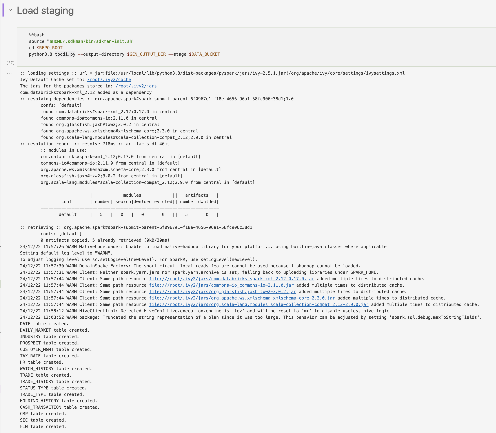
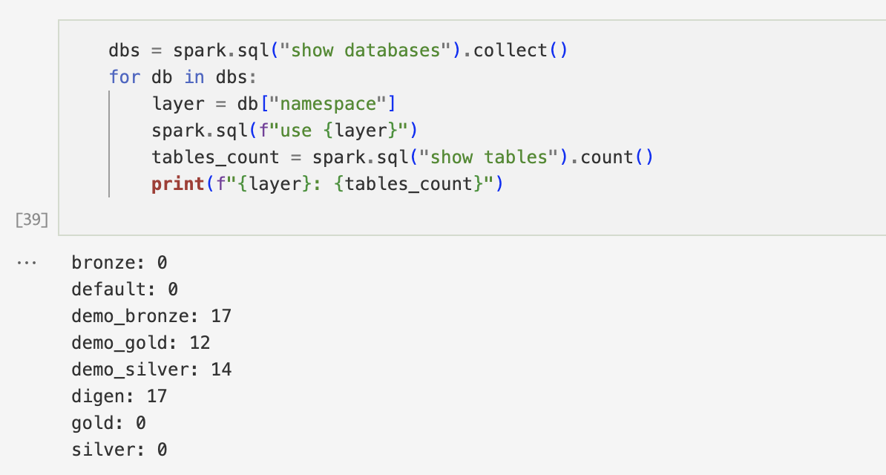

IMPORTANT ❗ ❗ ❗ Please remember to destroy all the resources after each work session. You can recreate infrastructure by creating new PR and merging it to master.


0. The goal of this phase is to create infrastructure, perform benchmarking/scalability tests of sample three-tier lakehouse solution and analyze the results using:
* [TPC-DI benchmark](https://www.tpc.org/tpcdi/)
* [dbt - data transformation tool](https://www.getdbt.com/)
* [GCP Composer - managed Apache Airflow](https://cloud.google.com/composer?hl=pl)
* [GCP Dataproc - managed Apache Spark](https://spark.apache.org/)
* [GCP Vertex AI Workbench - managed JupyterLab](https://cloud.google.com/vertex-ai-notebooks?hl=pl)

Worth to read:
* https://docs.getdbt.com/docs/introduction
* https://airflow.apache.org/docs/apache-airflow/stable/index.html
* https://spark.apache.org/docs/latest/api/python/index.html
* https://medium.com/snowflake/loading-the-tpc-di-benchmark-dataset-into-snowflake-96011e2c26cf
* https://www.databricks.com/blog/2023/04/14/how-we-performed-etl-one-billion-records-under-1-delta-live-tables.html

2. Authors:

   Group 3

   [***link to forked repo***](https://github.com/TBD-2024/tbd-workshop-1/tree/phase-2)

3. Sync your repo with https://github.com/bdg-tbd/tbd-workshop-1.

4. Provision your infrastructure.

    a) setup Vertex AI Workbench `pyspark` kernel as described in point [8](https://github.com/bdg-tbd/tbd-workshop-1/tree/v1.0.32#project-setup) 

    b) upload [tpc-di-setup.ipynb](https://github.com/bdg-tbd/tbd-workshop-1/blob/v1.0.36/notebooks/tpc-di-setup.ipynb) to     
the running instance of your Vertex AI Workbench

   


5. In `tpc-di-setup.ipynb` modify cell under section ***Clone tbd-tpc-di repo***:

   a)first, fork https://github.com/mwiewior/tbd-tpc-di.git to your github organization.

   b)create new branch (e.g. 'notebook') in your fork of tbd-tpc-di and modify profiles.yaml by commenting following lines:
   ```  
        #"spark.driver.port": "30000"
        #"spark.blockManager.port": "30001"
        #"spark.driver.host": "10.11.0.5"  #FIXME: Result of the command (kubectl get nodes -o json |  jq -r '.items[0].status.addresses[0].address')
        #"spark.driver.bindAddress": "0.0.0.0"
   ```
   This lines are required to run dbt on airflow but have to be commented while running dbt in notebook.

   c)update git clone command to point to ***your fork***.

 


6. Access Vertex AI Workbench and run cell by cell notebook `tpc-di-setup.ipynb`.

    a) in the first cell of the notebook replace: `%env DATA_BUCKET=tbd-2023z-9910-data` with your data bucket.

    ```
    %env DATA_BUCKET=tbd-2024z-336369-data
    %env GEN_OUTPUT_DIR=/tmp/tpc-di
    %env REPO_ROOT=/home/jupyter/git/tbd-tpc-di/
    ```

   b) in the cell:
         ```%%bash
         mkdir -p git && cd git
         git clone https://github.com/mwiewior/tbd-tpc-di.git
         cd tbd-tpc-di
         git pull
         ```
      replace repo with your fork. Next checkout to 'notebook' branch.

      ```
        %%bash
        mkdir -p git && cd git
        git clone https://github.com/TBD-2024/tbd-tpc-di
        cd tbd-tpc-di
        git pull
        git checkout notebook
        git pull
      ```
   
    c) after running first cells your fork of `tbd-tpc-di` repository will be cloned into Vertex AI  enviroment (see git folder).

    d) take a look on `git/tbd-tpc-di/profiles.yaml`. This file includes Spark parameters that can be changed if you need to increase the number of executors and
  ```
   server_side_parameters:
       "spark.driver.memory": "2g"
       "spark.executor.memory": "4g"
       "spark.executor.instances": "2"
       "spark.hadoop.hive.metastore.warehouse.dir": "hdfs:///user/hive/warehouse/"
  ```


7. Explore files created by generator and describe them, including format, content, total size.

Batch Folders:

-   Batch1: Contains the majority of the generated data (approximately 9.4 GB). This likely represents the initial historical data load.
-   Batch2: Contains incremental data updates (approximately 112 MB).
-   Batch3: Contains further incremental data updates (approximately 112 MB).

Each batch folder contains a similar set of files corresponding to the TPC-DI dimensions and facts, but with data specific to that batch's timeframe. The `Batch[1-3]_audit.csv` files provide metadata about each batch, including the date range covered.

File Format:

The files are primarily in two formats:

-   Pipe-delimited text files (.txt): Most of the dimension files (e.g., `Date.txt`, `Industry.txt`, `Trade.txt`) are in this format.
-   Comma-separated value files (.csv): Some files like `Prospect.csv` and `HR.csv` use this format.
-   XML files (.xml): `CustomerMgmt.xml` is an example of an XML file.
-   Fixed-width text files: The `FINWIRE` files are fixed-width, where each line represents a record, and fields are defined by their position within the line.

Content:

The files contain data related to a financial brokerage, including:

-   Dimension Data:
    -   `Date.txt`: Calendar and fiscal dates.
    -   `DailyMarket.txt`: Daily stock market data.
    -   `Industry.txt`: Industry classifications.
    -   `Prospect.csv`: Potential customer information.
    -   `TaxRate.txt`: Tax rates.
    -   `HR.csv`: Employee data.
    -   `WatchHistory.txt`: Customer watch list history.
    -   `Trade.txt`: Trade orders.
    -   `TradeHistory.txt`: Trade history.
    -   `StatusType.txt`: Trade status types.
    -   `TradeType.txt`: Trade types.
    -   `HoldingHistory.txt`: Account holding history.
    -   `CashTransaction.txt`: Cash transaction details.
-   Fact Data (FINWIRE):
    -   `FINWIRE`: Contains financial news wire data in a fixed-width format. It's further divided into:
        -   `CMP`: Company data.
        -   `SEC`: Security data.
        -   `FIN`: Financial data.

Total Size:

-   As indicated in the notebook and confirmed by the `digen_report.txt` file, with a scale factor of 100, the generated data is approximately 10 GiB.
-   The `digen_report.txt` file indicates a total of 162,228,471 records across all batches.
-   The `du -h` output shows the following sizes for each batch:
    -   `Batch1`: 9.4 GB
    -   `Batch2`: 112 MB
    -   `Batch3`: 112 MB

Additional Files:

-   Generator_audit.csv: Contains parameters used by the data generator.
-   Batch[1-3]_audit.csv: Contains information about each generated batch, including the first and last day of data in the batch.
-   digen_report.txt: Provides a summary of the data generation process, including start and end times, scale factor, total records, and performance metrics.

8. Analyze tpcdi.py. What happened in the loading stage?

The `tpcdi.py` script is responsible for loading the TPC-DI generated data into the data lakehouse. It uses Spark to perform the following steps:

1. Initialization:
2. File Processing (process_files function):
3. Data Loading (load_csv function):
4. File-Specific Loading Logic:

In essence, the loading stage involves:

1. Uploading the generated files to Google Cloud Storage.
2. Reading each file into a Spark DataFrame, applying the appropriate schema.
3. For `FINWIRE` files, performing transformations to extract fields from the fixed-width format.
4. Saving the DataFrames as Parquet tables in the `digen` database, which serves as the initial landing zone for the raw data.

Output:


9. Using SparkSQL answer: how many table were created in each layer?



10. Add some 3 more [dbt tests](https://docs.getdbt.com/docs/build/tests) and explain what you are testing. ***Add new tests to your repository.***

**fact_cash_balances_sk_customer_id.sql**  

- Ensures that every cash balance entry is associated with a valid customer.
- Failing this test means some transactions are missing customer IDs, which may indicate data integrity issues.

```sql
SELECT *
FROM {{ ref('fact_cash_balances') }}
WHERE sk_customer_id IS NULL
```

**fact_trade_sk_security_id.sql**  

- Ensures that every trade is linked to a valid security.
- Failing this test suggests missing security references, potentially due to ETL issues or incorrect joins.

```sql
SELECT *
FROM {{ ref('fact_trade') }}
WHERE sk_security_id IS NULL
```

**fact_trade_sk_trade_id.sql**  

- Ensures that sk_trade_id is unique and that no trade appears more than once.
- Failing this test indicates possible data duplication, which may lead to incorrect calculations in downstream analysis.

```sql
SELECT sk_trade_id, COUNT(*)
FROM {{ ref('fact_trade') }}
GROUP BY sk_trade_id
HAVING COUNT(*) > 1
```
   


11. In main.tf update
   ```
   dbt_git_repo            = "https://github.com/mwiewior/tbd-tpc-di.git"
   dbt_git_repo_branch     = "main"
   ```
   so dbt_git_repo points to your fork of tbd-tpc-di. 

   ```
   dbt_git_repo            = "https://github.com/TBD-2024/tbd-tpc-di.git"
   dbt_git_repo_branch     = "main"
   ```

12. Redeploy infrastructure and check if the DAG finished with no errors:

Unfortunately DAG finished with an error:

```
Error [2025-01-28, 23:21:14 UTC] {pod_manager.py:435} INFO - [base]   An error occurred while calling None.org.apache.spark.api.java.JavaSparkContext. [2025-01-28, 23:21:14 UTC] {pod_manager.py:435} INFO - [base]   : java.lang.IllegalArgumentException: Required executor memory (4096 MB), offHeap memory (0) MB, overhead (409 MB), and PySpark memory (0 MB) is above the max threshold (3278 MB) of this cluster! Please check the values of 'yarn.scheduler.maximum-allocation-mb' and/or 'yarn.nodemanager.resource.memory-mb'.
```
We tested limitting usage of spark memory:

```
spark = SparkSession.builder \
    .appName("TBD-TPC-DI-setup") \
    .master("yarn") \
    .enableHiveSupport() \
    .config("spark.executor.memory", "2g") \
    .config("spark.driver.memory", "2g") \
    .config("spark.yarn.executor.memoryOverhead", "256m") \
    .getOrCreate()

```
and applying higher limits:

```
spark = SparkSession.builder \
    .appName("TBD-TPC-DI-setup") \
    .master("yarn") \
    .enableHiveSupport() \
    .config("spark.executor.memory", "2g") \
    .config("spark.driver.memory", "2g") \
    .config("spark.yarn.executor.memoryOverhead", "256m") \
    .config("maximum-allocation-mb", "5120m") \
    .config("resource.memory-mb", "5120m") \
    .getOrCreate()

```
The first try did not fix an error. During the second test, we ran out of credits.

   


 


