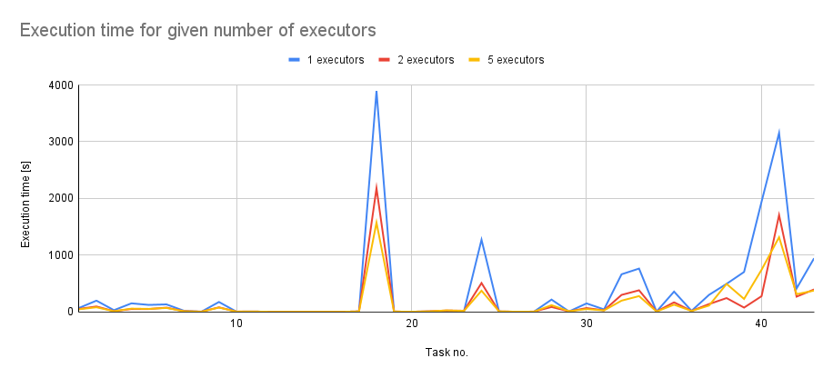

0. The goal of phase 2b is to perform benchmarking/scalability tests of sample three-tier lakehouse solution.

1. In main.tf, change machine_type at:

```
module "dataproc" {
  depends_on   = [module.vpc]
  source       = "github.com/bdg-tbd/tbd-workshop-1.git?ref=v1.0.36/modules/dataproc"
  project_name = var.project_name
  region       = var.region
  subnet       = module.vpc.subnets[local.notebook_subnet_id].id
  machine_type = "e2-standard-2"
}
```

and subsititute "e2-standard-2" with "e2-standard-4".

2. If needed request to increase cpu quotas (e.g. to 30 CPUs): 
https://console.cloud.google.com/apis/api/compute.googleapis.com/quotas?project=tbd-2023z-9918

3. Using tbd-tpc-di notebook perform dbt run with different number of executors, i.e., 1, 2, and 5, by changing:
```
 "spark.executor.instances": "2"
```

in profiles.yml.

4. In the notebook, collect console output from dbt run, then parse it and retrieve total execution time and execution times of processing each model. Save the results from each number of executors. 

5. Analyze the performance and scalability of execution times of each model. Visualize and discuss the final results.



After gathering and visualizing the results of three full dbt runs for 1, 2 and 5 executors, we can see several resource-intensive tasks that produce spikes up to 4000 seconds. These tasks seem to be a great example of scalability, as their execution time changes are the most visible - the largest change was reported for task 18, which was processed with 5 executors in just 40% of the time needed with 1 executor.

Adding another executor has allowed the program to finish in just 45% of the time required for running with just one executor - this means that the performance has more than doubled. However, adding 3 additional executors did not produce the same performance spike as the one reported above. A dbt run with 5 executors has used nearly 93% of time that was needed for a full run with 2 executors.

There are also some anomalies present in the tasks with low execution times, where more executors actually produced higher execution times. This oddity can be explained with the scheduling logic needed to start the processing of a given task - in some cases, this operation may take longer than the task itself, which bloats the total execution time.

In summary, increasing the number of executors increases the overall performance of the algorithm, which can be seen especially for large, resource-intensive tasks. It is crucial to check which number of executors provides the best performance while keeping the resource cost as low as possible.