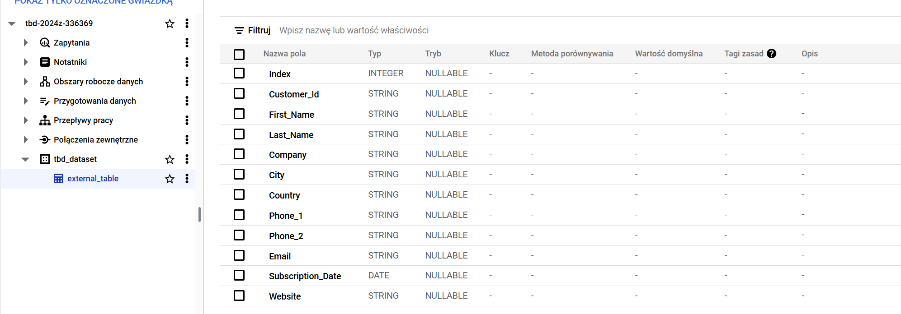
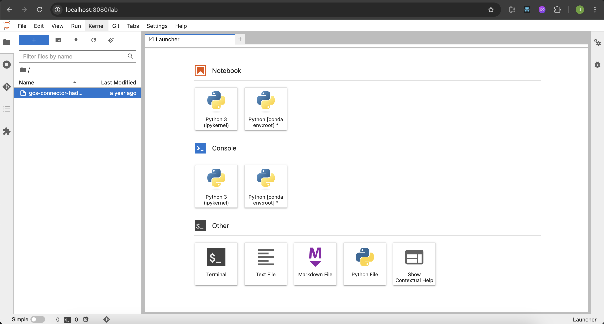
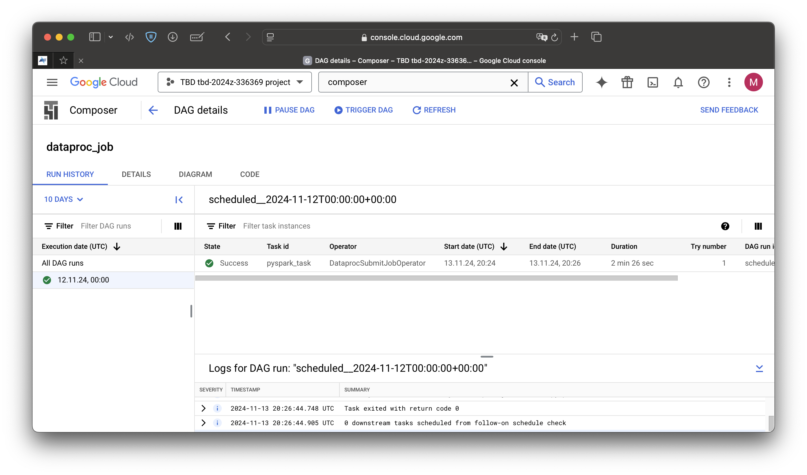
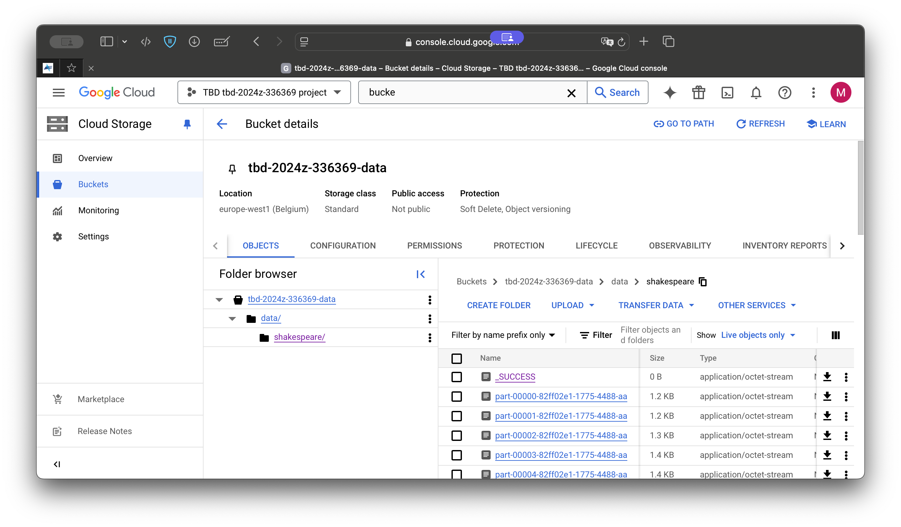
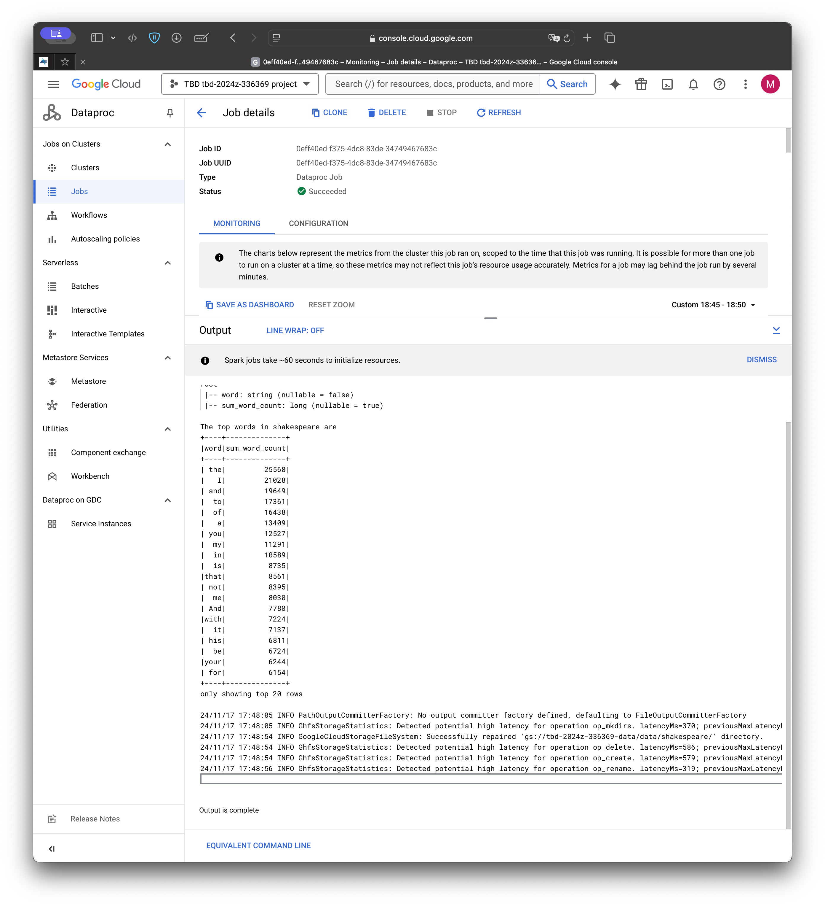
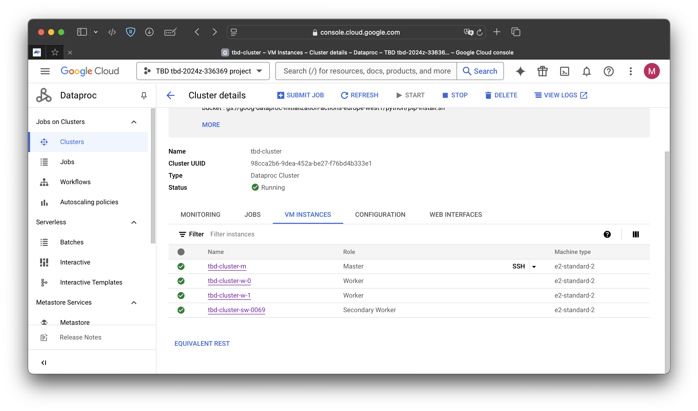
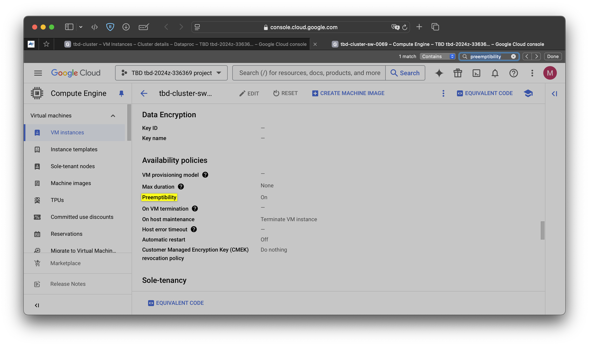

IMPORTANT ❗ ❗ ❗ Please remember to destroy all the resources after each work session. You can recreate infrastructure by creating new PR and merging it to master.
  


1. Authors:

   Group 3

   [***link to forked repo***](https://github.com/TBD-2024/tbd-workshop-1)
   
2. Follow all steps in README.md.

3. Select your project and set budget alerts on 5%, 25%, 50%, 80% of 50$ (in cloud console -> billing -> budget & alerts -> create budget; unclick discounts and promotions&others while creating budget).

  

4. From available Github Actions select and run destroy on main branch.
   
5. Create new git branch and:
    1. Modify tasks-phase1.md file.
    
    2. Create PR from this branch to **YOUR** master and merge it to make new release. 
    
   

6. Analyze terraform code. Play with terraform plan, terraform graph to investigate different modules.

    The "dataproc" module is used to implement the Cloud Dataproc cluster, which allows us to use various tools such as Apache Hadoop and Apache Spark. This service is configured to run in the europe-west1 region (St. Ghislain, Belgium) and use the e2-medium VM, which has two vCPUs and 4 GB of RAM. The module is set to work on the Ubuntu 20 OS image with a 100 GB standard persistent HDD disk (pd-standard). The cluster has two workers equipped with the same type of disk.

    
   
7. Reach YARN UI
   
    Command:

    ```
    gcloud compute ssh tbd-cluster-m \
        --project=tbd-2024z-336369 -- \
        -L 1080:tbd-cluster-m:8088 -N -n
    ```

    Port: 1080 \
    The default SOCKS proxy could not be used, so local port forwarding was applied to view the YARN UI on port 1080 instead of the expected 8088.

    
    
8. Draw an architecture diagram (e.g. in draw.io) that includes:
    1. VPC topology with service assignment to subnets
    2. Description of the components of service accounts
    3. List of buckets for disposal
    4. Description of network communication (ports, why it is necessary to specify the host for the driver) of Apache Spark running from Vertex AI Workbech
  
    ***place your diagram here***

9. Create a new PR and add costs by entering the expected consumption into Infracost
For all the resources of type: `google_artifact_registry`, `google_storage_bucket`, `google_service_networking_connection`
create a sample usage profiles and add it to the Infracost task in CI/CD pipeline. Usage file [example](https://github.com/infracost/infracost/blob/master/infracost-usage-example.yml) 

   ```
    resource_type_default_usage:
    module.data-pipelines.google_storage_bucket.tbd-code-bucket:
    storage_gb: 192                         
    monthly_class_a_operations: 1000000       
    monthly_class_b_operations: 12500000       
    monthly_egress_data_transfer_gb:
      same_continent: 550                   
      worldwide: 12500                        
      asia: 1500                              
      china: 50                              
      australia: 250                         
    module.data-pipelines.google_storage_bucket.tbd-data-bucket:
    storage_gb: 192                         
    monthly_class_a_operations: 1000000       
    monthly_class_b_operations: 12500000       
    monthly_egress_data_transfer_gb:
      same_continent: 550                   
      worldwide: 12500                        
      asia: 1500                              
      china: 50                              
      australia: 250  
    module.vertex_ai_workbench.google_storage_bucket.notebook-conf-bucket:
    storage_gb: 192                         
    monthly_class_a_operations: 1000000       
    monthly_class_b_operations: 12500000       
    monthly_egress_data_transfer_gb:
      same_continent: 550                   
      worldwide: 12500                        
      asia: 1500                              
      china: 50                              
      australia: 250 
    google_storage_bucket.tbd-state-bucket:
    storage_gb: 192                         
    monthly_class_a_operations: 1000000       
    monthly_class_b_operations: 12500000       
    monthly_egress_data_transfer_gb:
      same_continent: 550                   
      worldwide: 12500                        
      asia: 1500                              
      china: 50                              
      australia: 250 
    module.gcp_mlflow_appengine.google_storage_bucket.mlflow_artifacts_bucket:
    storage_gb: 192                         
    monthly_class_a_operations: 1000000       
    monthly_class_b_operations: 12500000       
    monthly_egress_data_transfer_gb:
      same_continent: 550                   
      worldwide: 12500                        
      asia: 1500                              
      china: 50                              
      australia: 250 
    google_artifact_registry_repository.registry:
    storage_gb: 50                            
    module.gcp_mlflow_appengine.google_service_networking_connection.private_vpc_connection:
    monthly_egress_data_transfer_gb:
      same_region: 250                   
      us_or_canada: 100                     
      europe: 70                         
      asia: 50                           
      south_america: 100                   
      oceania: 50               
      worldwide: 200     
   ```

   ***place the screenshot from infracost output here***
    

   

10. Create a BigQuery dataset and an external table using SQL
    
    ```
    CREATE SCHEMA IF NOT EXISTS tbd_dataset;
    CREATE OR REPLACE EXTERNAL TABLE tbd_dataset.external_table
    OPTIONS (
      format = 'CSV',
      uris = ['gs://tbd_sample/customers-100.csv']
    );
    SELECT * FROM tbd_dataset.external_table;
    ```
    
   
    ***why does ORC not require a table schema?***
    The ORC (Optimized Row Columnar) format contains metadata that describes the schema of the data. 
    This means that BigQuery can read this schema without having to manually define it when creating the table.

  
11. Start an interactive session from Vertex AI workbench:

    
   
12. Find and correct the error in spark-job.py

    Specified data bucket was incorrect. Changes applied to spark-job.py:

    ```
    -DATA_BUCKET = "gs://tbd-2025z-9900-data/data/shakespeare/"
    +DATA_BUCKET = "gs://tbd-2024z-336369-data/data/shakespeare/"
    ```

    Result in Composer:
    

    Result in Cloud Storage:
    

    Result in Dataproc job:
    

13. Additional tasks using Terraform:

    1. Add support for arbitrary machine types and worker nodes for a Dataproc cluster and JupyterLab instance

    [***vertex main***](https://github.com/TBD-2024/tbd-workshop-1/blob/master/modules/vertex-ai-workbench/main.tf)
    ```
    machine_type = var.vertex_machine_type
    ```
    [***vertex variables***](https://github.com/TBD-2024/tbd-workshop-1/blob/master/modules/vertex-ai-workbench/variables.tf)
    ```
    variable "vertex_machine_type" {
      description = "Vertex Machine type"
      type        = string
    default     = "e2-standard-2"
    }
    ```
    [***dataproc main***](https://github.com/TBD-2024/tbd-workshop-1/blob/master/modules/dataproc/main.tf)
    Edited code:
    ```
    master_config {
      num_instances = 1
      machine_type  = var.master_machine_type
      disk_config {
        boot_disk_type    = "pd-standard"
        boot_disk_size_gb = 100
      }
    }
    worker_config {
      num_instances = var.num_worker_nodes
      machine_type  = var.worker_machine_type
      disk_config {
        boot_disk_type    = "pd-standard"
        boot_disk_size_gb = 100
      }
    }
    ```
    [***dataproc variables***](https://github.com/TBD-2024/tbd-workshop-1/blob/master/modules/dataproc/variables.tf)
    ```
    variable "num_worker_nodes" {
      description = "Number of worker nodes in the Dataproc cluster"
      type        = number
      default     = 2
    }

    variable "worker_machine_type" {
      description = "Worker Machine type"
      type        = string
      default     = "e2-medium"
    }

    variable "master_machine_type"{
      description = "Master Machine type"
      type        = string
      default     = "n1-standard-4"
    }
    ```
  
    
    2. Add support for preemptible/spot instances in a Dataproc cluster

    [***link to the modified file***](https://github.com/TBD-2024/tbd-workshop-1/blob/master/modules/dataproc/main.tf)

    ```
    resource "google_dataproc_cluster" "tbd-dataproc-cluster" {

        ...

        preemptible_worker_config {
            num_instances = 1
        }
    }
    ```
    
    
    
    3. Perform additional hardening of Jupyterlab environment, i.e. disable sudo access and enable secure boot
    
    [***link to the modified file***](https://github.com/TBD-2024/tbd-workshop-1/blob/master/modules/vertex-ai-workbench/main.tf)
   
    ```
    shielded_instance_config {
        enable_secure_boot = true
    }
    # ...
    metadata = {
        notebook-disable-root = "true"
        vmDnsSetting          = "GlobalDefault"
    }
    ```

    4. (Optional) Get access to Apache Spark WebUI

    [***link to the modified file***](https://github.com/TBD-2024/tbd-workshop-1/blob/master/modules/dataproc/main.tf)

    ```
    endpoint_config {
      enable_http_port_access = "true"
    }
    ```
