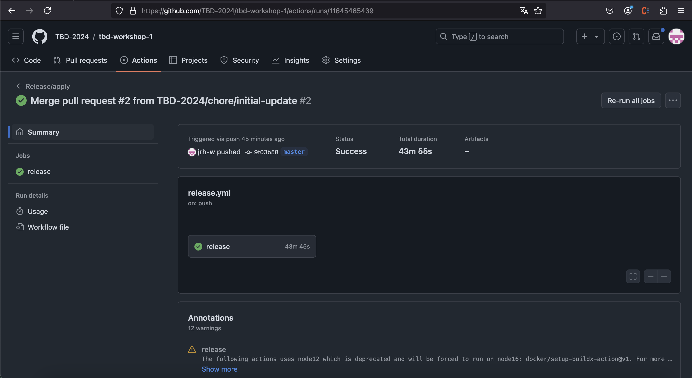
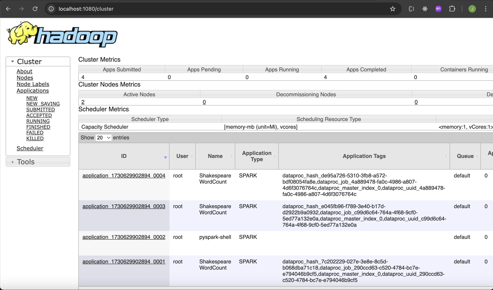

IMPORTANT ❗ ❗ ❗ Please remember to destroy all the resources after each work session. You can recreate infrastructure by creating new PR and merging it to master.
  


1. Authors:

   Group 3

   [***link to forked repo***](https://github.com/TBD-2024/tbd-workshop-1)
   
2. Follow all steps in README.md.

3. Select your project and set budget alerts on 5%, 25%, 50%, 80% of 50$ (in cloud console -> billing -> budget & alerts -> create budget; unclick discounts and promotions&others while creating budget).

  

4. From available Github Actions select and run destroy on main branch.
   
5. Create new git branch and:
    1. Modify tasks-phase1.md file.
    
    2. Create PR from this branch to **YOUR** master and merge it to make new release. 
    
   

6. Analyze terraform code. Play with terraform plan, terraform graph to investigate different modules.

    The "dataproc" module is used to implement the Cloud Dataproc cluster, which allows us to use various tools such as Apache Hadoop and Apache Spark. This service is configured to run in the europe-west1 region (St. Ghislain, Belgium) and use the e2-medium VM, which has two vCPUs and 4 GB of RAM. The module is set to work on the Ubuntu 20 OS image with a 100 GB standard persistent HDD disk (pd-standard). The cluster has two workers equipped with the same type of disk.

    
   
7. Reach YARN UI
   
    Command:

    ```
    gcloud compute ssh tbd-cluster-m \
        --project=tbd-2024z-336369 -- \
        -L 1080:tbd-cluster-m:8088 -N -n
    ```

    Port: 1080 \
    The default SOCKS proxy could not be used, so local port forwarding was applied to view the YARN UI on port 1080 instead of the expected 8088.

    
    
8. Draw an architecture diagram (e.g. in draw.io) that includes:
    1. VPC topology with service assignment to subnets
    2. Description of the components of service accounts
    3. List of buckets for disposal
    4. Description of network communication (ports, why it is necessary to specify the host for the driver) of Apache Spark running from Vertex AI Workbech
  
    ***place your diagram here***

9. Create a new PR and add costs by entering the expected consumption into Infracost
For all the resources of type: `google_artifact_registry`, `google_storage_bucket`, `google_service_networking_connection`
create a sample usage profiles and add it to the Infracost task in CI/CD pipeline. Usage file [example](https://github.com/infracost/infracost/blob/master/infracost-usage-example.yml) 

   ***place the expected consumption you entered here***

   ***place the screenshot from infracost output here***

10. Create a BigQuery dataset and an external table using SQL
    
    ***place the code and output here***
   
    ***why does ORC not require a table schema?***

  
11. Start an interactive session from Vertex AI workbench:

    
   
12. Find and correct the error in spark-job.py

    Specified data bucket was incorrect. Changes applied to spark-job.py:

```
-DATA_BUCKET = "gs://tbd-2025z-9900-data/data/shakespeare/"
+DATA_BUCKET = "gs://tbd-2024z-336369-data/data/shakespeare/"
```

13. Additional tasks using Terraform:

    1. Add support for arbitrary machine types and worker nodes for a Dataproc cluster and JupyterLab instance

    ***place the link to the modified file and inserted terraform code***
    
    2. Add support for preemptible/spot instances in a Dataproc cluster

    ***place the link to the modified file and inserted terraform code***
    
    3. Perform additional hardening of Jupyterlab environment, i.e. disable sudo access and enable secure boot
    
    [***link to the modified file***](https://github.com/TBD-2024/tbd-workshop-1/blob/master/modules/vertex-ai-workbench/main.tf)
   
    ```
    shielded_instance_config {
        enable_secure_boot = true
    }
    # ...
    metadata = {
        notebook-disable-root = "true"
        vmDnsSetting          = "GlobalDefault"
    }
    ```

    4. (Optional) Get access to Apache Spark WebUI

    [***link to the modified file***](https://github.com/TBD-2024/tbd-workshop-1/blob/master/modules/dataproc/main.tf)

    ```
    endpoint_config {
      enable_http_port_access = "true"
    }
    ```
